# CONFIGURACIÓN DE RED
## Hacemos dos clonaciones cambiando la MAC

-A

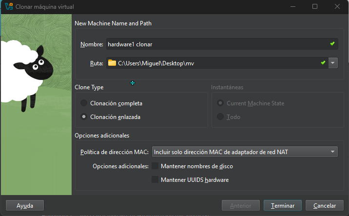

-B

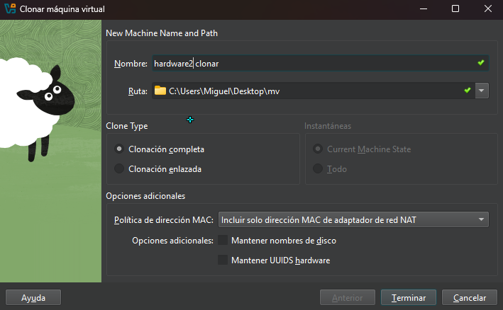

# Ahora activamos una red más llamada internet

-A

-B

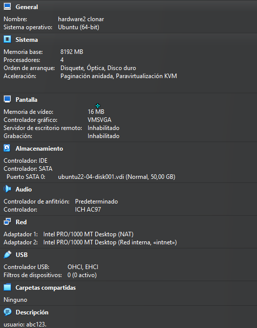

# Ahora empezamos a ponerles las ips

-A

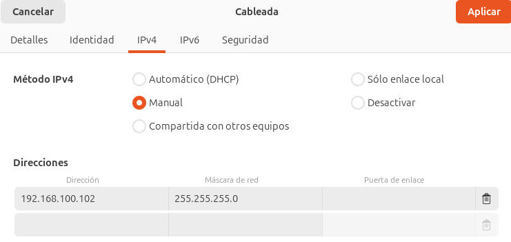

-B

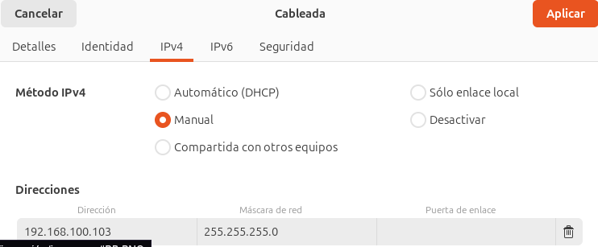

# Ahora hacemos ping entre ellas

A-

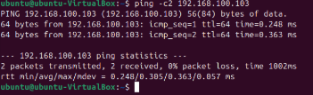

B-

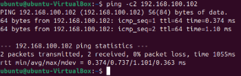

# Actualizamos los paquetes de la máquina A

-A

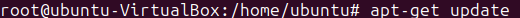

# Instalamos ifupdown

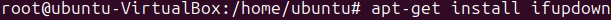

# Editamos el archivo de configuración netpal

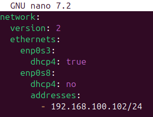

# Comprobamos

# Lo aplicamos

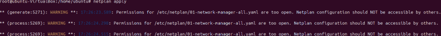

# Comprobamos de q se realice

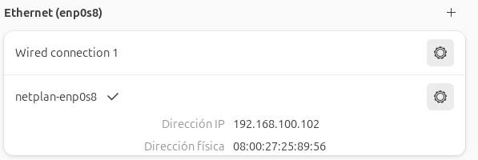

# B se hace de modo gráfico

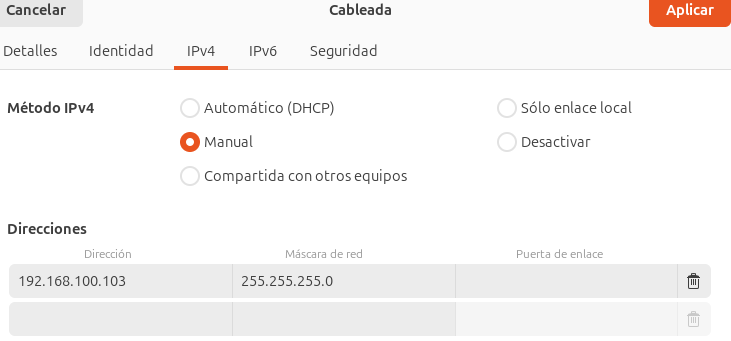

