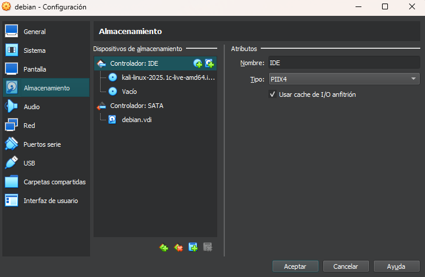
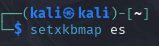
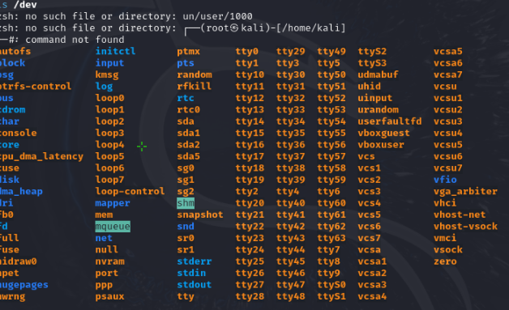
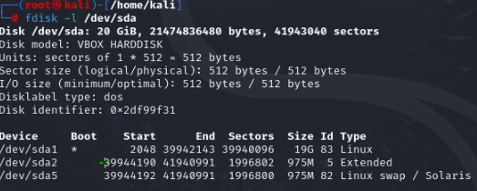
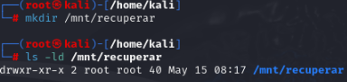
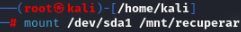
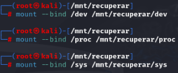
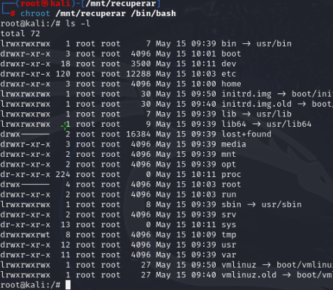
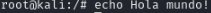

# Montado de un sistema de ficheros con Chroot
## 1.	Realiza una instalación desde cero de una máquina virtual con sistema operativo debian y en ella tiene que existir un usuario cuyo nombre sea tu nombre personal.

## 2. Ahora empezamos a montar el kali sobre el debian

## 2. Empezamos con la terminal

a. Cambiar a castellano el teclado

b. Iniciamos sesión como root con "sudo su" y confirmamos en /dev que este el sda1

c. Usaremos el "chroot" para modificar el live de Kali y entramos en Debian

d. Montamos el disco /dev/sda1 en /mnt/recuperar

# Verificación
## 1. Generamos un archivo de prueba dentro del entorno Debian montado y posteriormente accedimos a Debian para verificar que se hubiera creado correctamente.

a. El archivo creado estara en la ruta "/home/miguel/pruebla.txt"

