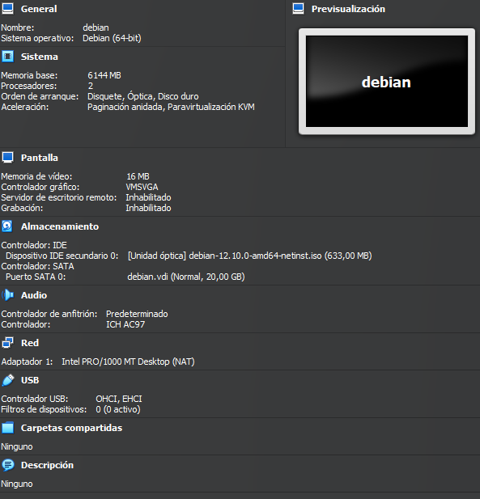
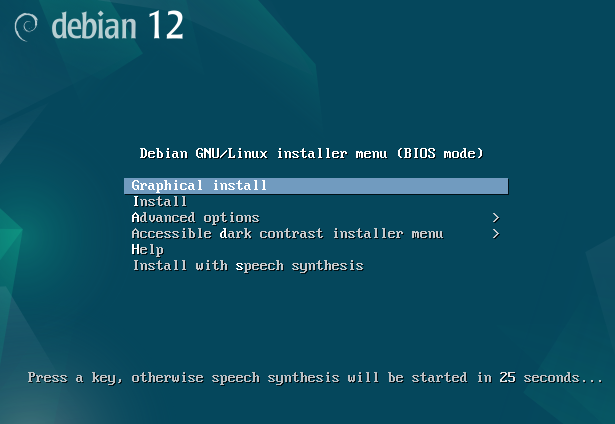
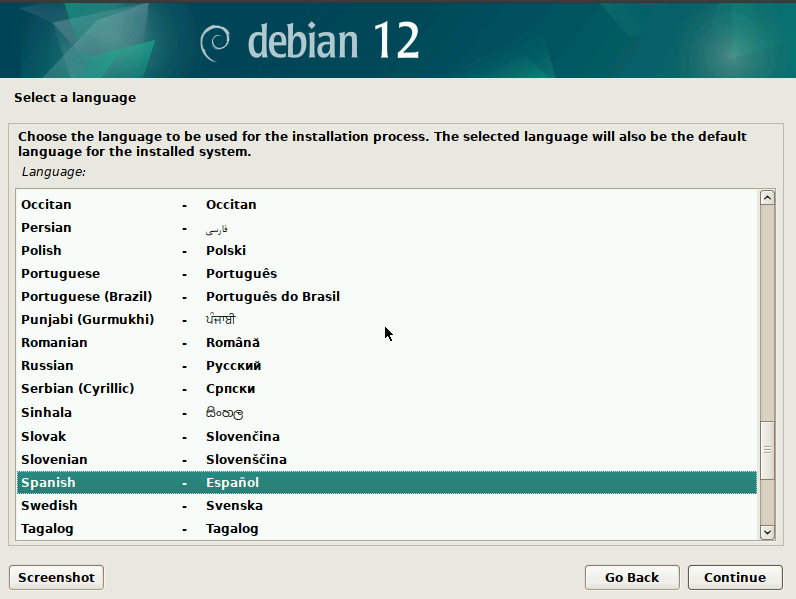
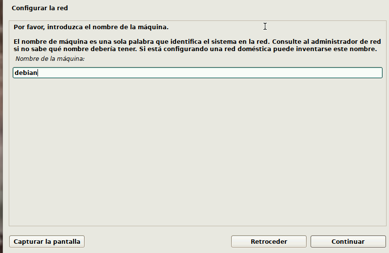
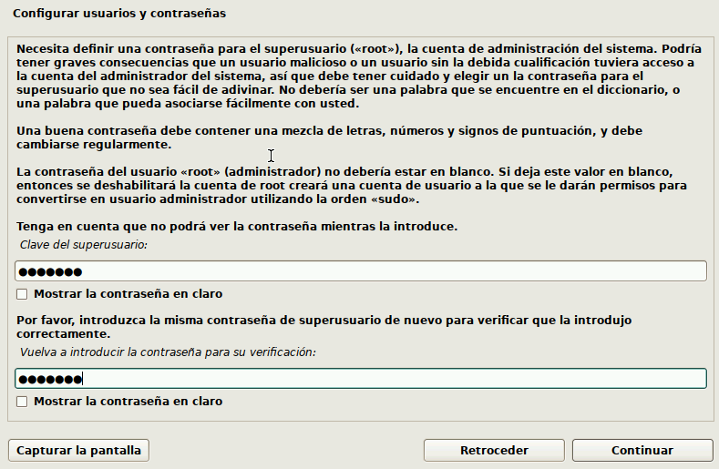
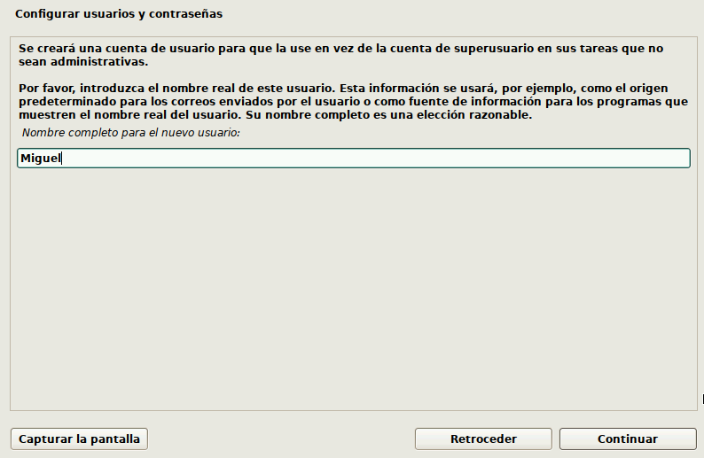
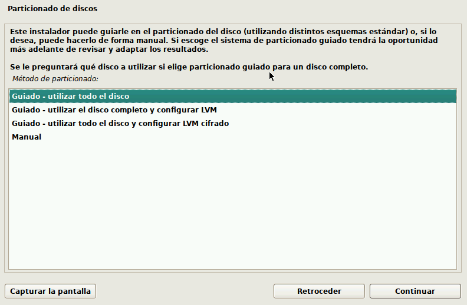
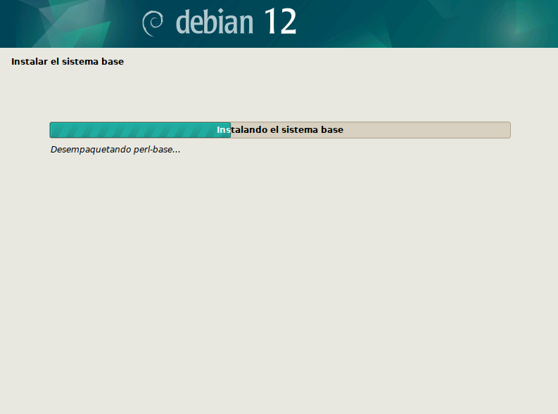
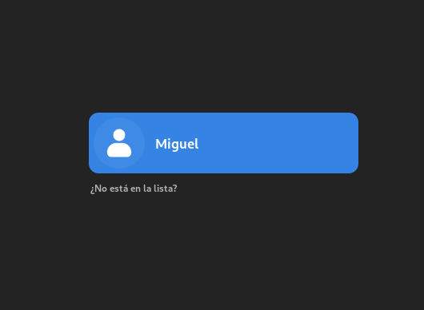

# Montado de un sistema de ficheros con Chroot
## 1.	Realiza una instalación desde cero de una máquina virtual con sistema operativo debian y en ella tiene que existir un usuario cuyo nombre sea tu nombre personal.

