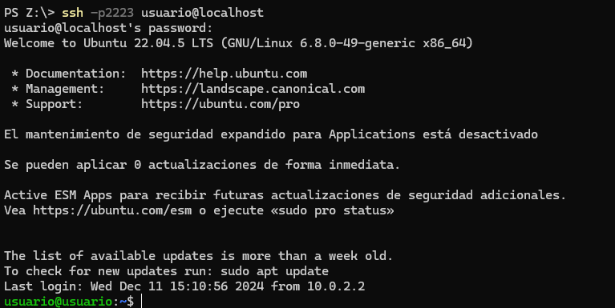
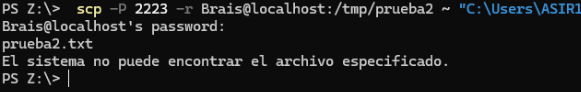
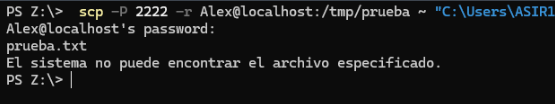

# Práctica SSH

## Configuración Inicial

1. Configuramos los puertos de red de nuestras dos máquinas virtuales:
   - Máquina A: puerto 2222
   - Máquina B: puerto 2223

  
  

2. Nos conectamos por el **SSH** a las dos máquinas.

  
  

## Creamos los usuarios

- En la máquina **A**, creamos el usuario `Alez`.

  

- En la máquina **B**, creamos el usuario `Brais`.

  

## Conexión SSH entre Máquinas

- Desde la máquina **A**, realizamos una conexión SSH hacia la máquina **B**.

  

- Al conectarnos, se genera un archivo `known_hosts` en `~/.ssh/` que guarda la huella digital del servidor B.

  ## Transferencia de Archivos

  1. En la máquina **A**, creamos el directorio `prueba` con el archivo `prueba.txt` en la ruta temporal y enviamos la información a la máquina B.

  

  2. En la máquina **B**, creamos el directorio `prueba2` con el archivo `prueba2.txt` en su ruta temporal y lo enviamos a la A. (antes de ese comando ejecutaremos este: mkdir /tmp/prueba2)

  

  3. Pasaremos los directorios `prueba` y `prueba2` al ordenador anfitrión. Ejecutamos los comandos necesarios desde la máquina anfitrión.(la ruta es C:\Users\ASIR115\Desktop\ q sale cortada q no me di cuenta)

  
  
  

  4. Creamos el directorio `prueba3` en el servidor con **200 archivos .txt** y lo transmitimos al escritorio del anfitrión.

  
  
  (en esta imagen el comando es acp -p 2222 -r Alex@localhost:/tmp/prueba3 ∼ "C:\Users\ASIR115\Desktop\")
  
  

  ## Conexión SSH con clave y passphrase

1. Generamos un par de claves en el cliente.
2. Establecemos la conexión con el servidor.
3. Creamos la frase de paso (*passphrase*) con el valor `servidorssh`.
4. Nos conectamos desde el usuario **Alex** al usuario **Brais** utilizando la clave correspondiente a `servidorssh`.

